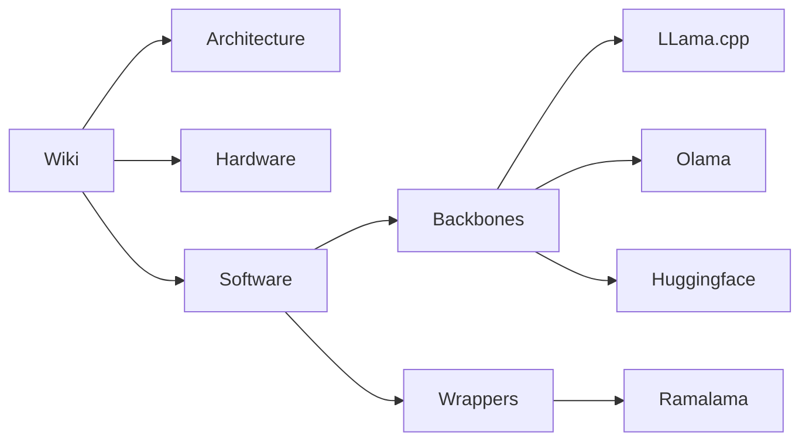

# wiki
Place for all our docs and whitepapers

```mermaid
flowchart LR
wiki[Wiki]
arch[Architecture]
hw[Hardware]
sw[Software]
wp[Wrappers]
bb[Backbones]
llcp[LLama.cpp]
olm[Olama]
hf[Huggingface]
rlm[Ramalama]

wiki --> hw
wiki --> sw
wiki --> arch
sw   --> bb
sw   --> wp
bb   --> llcp
bb   --> olm
bb   --> hf
wp   --> rlm

click wiki "#Readme.md"
click hw "./hardware"
click llcpp "./llamacpp"
click rlm "./ramalama.md"
```
