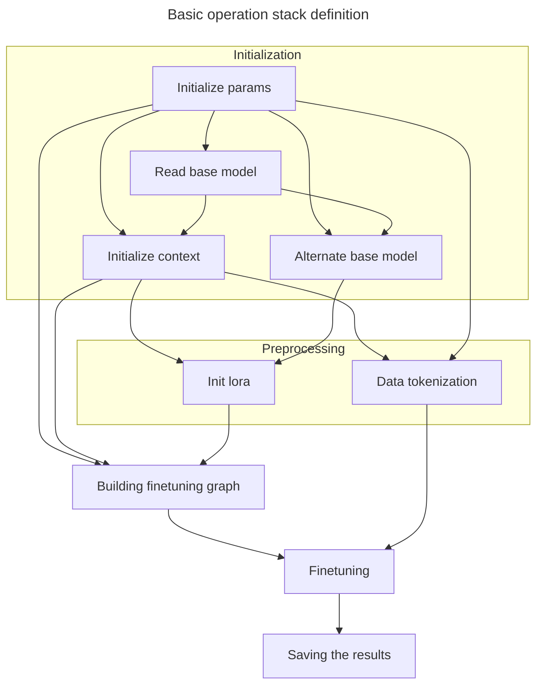
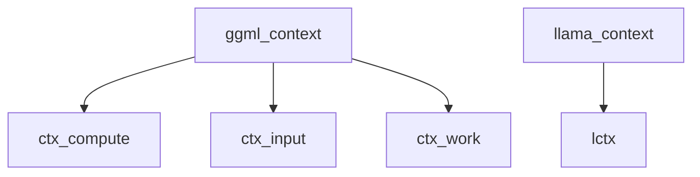
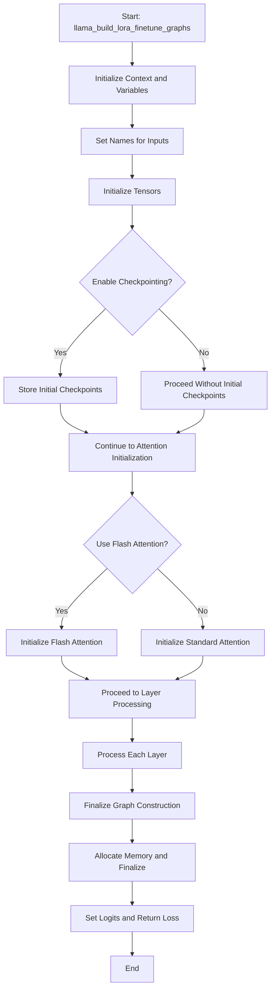

# llamacpp LORA 

## Lora implementation inside llama.cpp

[SOURCE](https://github.com/xaedes/llama.cpp/tree/finetune-lora)



## Breaking things up

### Parameters initialization
#### Lora parameters
Initializing parameters for lora training.

This set of parameters is specific for lora finetuning tasks
<details>
<summary>Parameters initialization code</summary>

```c++
static struct train_params get_default_train_params() {
    struct train_params params;
    params.common = get_default_train_params_common();
    params.fn_model_base     = "";
    params.fn_lora_out       = "ggml-lora-ITERATION-f32.gguf";

    params.only_write_lora = false;

    params.f_norm_rms_eps  = 1e-5f;
    params.rope_freq_base  = 10000.0f;
    params.rope_freq_scale = 1.0f;

    params.custom_f_norm_rms_eps  = false;
    params.custom_rope_freq_base  = false;
    params.custom_rope_freq_scale = false;

    params.lora_r      = 4; // lora rank
    params.lora_alpha  = 4; // scale of the lora impact
    params.custom_lora_alpha = false;

    // Specific params for lora ranks
    // Maintaining those ranks should benefit with performance/quality measures.
    // The higher the rank, the more accurate changes introduced by lora, but computation and storage  requirements wbt up as well.
    params.n_rank_attention_norm = 1;
    params.n_rank_wq             = 4;
    params.n_rank_wk             = 4;
    params.n_rank_wv             = 4;
    params.n_rank_wo             = 4;
    params.n_rank_ffn_norm       = 1;
    params.n_rank_w1             = 4;
    params.n_rank_w2             = 4;
    params.n_rank_w3             = 4;
    params.n_rank_tok_embeddings = 4;
    params.n_rank_norm           = 1;
    params.n_rank_output         = 4;

    params.custom_n_rank_attention_norm = false;
    params.custom_n_rank_wq             = false;
    params.custom_n_rank_wk             = false;
    params.custom_n_rank_wv             = false;
    params.custom_n_rank_wo             = false;
    params.custom_n_rank_ffn_norm       = false;
    params.custom_n_rank_w1             = false;
    params.custom_n_rank_w2             = false;
    params.custom_n_rank_w3             = false;
    params.custom_n_rank_tok_embeddings = false;
    params.custom_n_rank_norm           = false;
    params.custom_n_rank_output         = false;

    return params;
}
```

</details>

#### Default model paramaters
Initializing parameters for model processing.

<details>

Defining default parameters values.

This is a parameters for typical llama model.
```c++
struct llama_model_params llama_model_default_params() {
    struct llama_model_params result = {
        /*.n_gpu_layers                =*/ 0,
        /*.main_gpu                    =*/ 0,
        /*.tensor_split                =*/ nullptr,
        /*.progress_callback           =*/ nullptr,
        /*.progress_callback_user_data =*/ nullptr,
        /*.vocab_only                  =*/ false,
        /*.use_mmap                    =*/ true,
        /*.use_mlock                   =*/ false,
    };
#ifdef GGML_USE_METAL
    result.n_gpu_layers = 1;
#endif

    return result;
}
```

Actual parameters meanings
```c++
struct llama_model_params {
        int32_t n_gpu_layers; // number of layers to store in VRAM
        int32_t main_gpu;     // the GPU that is used for scratch and small tensors
        const float * tensor_split; // how to split layers across multiple GPUs (size: LLAMA_MAX_DEVICES)

        // called with a progress value between 0 and 1, pass NULL to disable
        llama_progress_callback progress_callback;
        // context pointer passed to the progress callback
        void * progress_callback_user_data;

        // Keep the booleans together to avoid misalignment during copy-by-value.
        bool vocab_only; // only load the vocabulary, no weights
        bool use_mmap;   // use mmap if possible
        bool use_mlock;  // force system to keep model in RAM
    };
```

</details>

### Reading base model

The idea is to read reference model, to make some modifications to it later. 

It's quite simple:

Reading model -> alternating model to introduce adapters -> finetuning -> profit
```cpp
struct llama_model * lmodel = llama_load_model_from_file(params.fn_model_base, llama_params);
```

### Alternating base model

Alternate base model of type `llama_model` -> `my_llama_model`. Not really sure why. The difference that I observe is eliminating bias in `my_llama_layer` which is replacement for base `llama_layer`.


Nothing really special about this method. Just basic mapping and shapes assertion as far as I can see.
#### Base model alternation

```c++
init_model(lmodel, &model, params.fn_model_base, params.common.n_ctx);
```

[Link to the method implementation](https://github.com/xaedes/llama.cpp/blob/546112944a0e025ec4a11d23dc57730041b8d273/examples/finetune/finetune.cpp#L278)

### Context initialization

During finetuning different contexts are used:

1. `ggml_context`
    
    Used for memory and state management for tensor operations. Therefore all computation graphs are defined inside a context.

    <details>

    ```c++
    struct ggml_context {
        size_t mem_size;
        void * mem_buffer;
        bool   mem_buffer_owned;
        bool   no_alloc;
        bool   no_alloc_save; // this is used to save the no_alloc state when using scratch buffers

        int    n_objects;

        struct ggml_object * objects_begin;
        struct ggml_object * objects_end;

        struct ggml_scratch scratch;
        struct ggml_scratch scratch_save;
    };
    ```

    </details>

2. `llama_context`

    Used for model state and data management. Incapsulates `qqml_context` as a part of `llama_model` structure.

    <details>

    ```c++
        struct llama_context {
        llama_context(const llama_model & model) : model(model), t_load_us(model.t_load_us), t_start_us(model.t_start_us) {}
        ~llama_context() {
            if (model_owner) {
                delete &model;
            }
    #ifdef GGML_USE_METAL
            if (ctx_metal) {
                ggml_metal_free(ctx_metal);
            }
    #endif
            if (alloc) {
                ggml_allocr_free(alloc);
            }
        }

        std::mt19937 rng;

        bool has_evaluated_once = false;

        int64_t t_sample_us = 0;
        int64_t t_eval_us   = 0;
        int64_t t_p_eval_us = 0;

        int32_t n_sample = 0; // number of tokens sampled
        int32_t n_eval   = 0; // number of eval calls
        int32_t n_p_eval = 0; // number of tokens in eval calls for the prompt (with batch size > 1)

        const llama_model & model;

        bool model_owner = false;

        int64_t t_load_us;
        int64_t t_start_us;

        // key + value cache for the self attention
        struct llama_kv_cache kv_self;

        // decode output (2-dimensional array: [n_tokens][n_vocab])
        std::vector<float> logits;
        bool logits_all = false;

        // input embedding (1-dimensional array: [n_embd])
        std::vector<float> embedding;

        // reusable buffer for `struct ggml_graph_plan.work_data`
        std::vector<uint8_t> work_buffer;

        // memory buffers used to evaluate the model
        llama_buffer buf_compute;

        llama_buffer buf_alloc;
        ggml_allocr * alloc = NULL;

    #ifdef GGML_USE_METAL
        ggml_metal_context * ctx_metal = NULL;
    #endif

    #ifdef GGML_USE_MPI
        ggml_mpi_context * ctx_mpi = NULL;
    #endif
    };
    ```

    </details>



1. `lctx` - context for llama model and token processing.
2. `ctx_compute` - context for assigning finetune graph
3. `ctx_input` - context for assigning and managing input tensors *wihtout their data apparantely*
4. `ctx_work` - context for performing actual finetuning, invocating `ggml_opt_result ggml_opt_resume_g` method 

### Lora initialization

Method where the most of the magic happens.

```c++
init_lora(&model, &lora);
```
[Link to the method implementation](https://github.com/xaedes/llama.cpp/blob/546112944a0e025ec4a11d23dc57730041b8d273/examples/finetune/finetune.cpp#L438)

Idea is to introduce additional values into the layer definition.

And then this weights will be used in computation graph such as:
```math
h = W_0x + \Delta Wx = W_0x + BAx
```
where:
- $B$, $A$ - low dimension matrices
- $W_0$ - original weights, frozen during finetuning


<details>
<summary>Adding new tensors to the layers</summary>

```c++
layer.attention_norm_a = ggml_new_tensor_2d(ctx, GGML_TYPE_F32, lparams.n_rank_attention_norm, n_embd);
layer.attention_norm_b = ggml_new_tensor_2d(ctx, GGML_TYPE_F32, lparams.n_rank_attention_norm, 1);

// Additional weights for attention module
layer.wq_a = ggml_new_tensor_2d(ctx, GGML_TYPE_F32, lparams.n_rank_wq, n_embd);
layer.wq_b = ggml_new_tensor_2d(ctx, GGML_TYPE_F32, lparams.n_rank_wq, n_embd);
layer.wk_a = ggml_new_tensor_2d(ctx, GGML_TYPE_F32, lparams.n_rank_wk, n_embd);
layer.wk_b = ggml_new_tensor_2d(ctx, GGML_TYPE_F32, lparams.n_rank_wk, n_embd_gqa);
layer.wv_a = ggml_new_tensor_2d(ctx, GGML_TYPE_F32, lparams.n_rank_wv, n_embd);
layer.wv_b = ggml_new_tensor_2d(ctx, GGML_TYPE_F32, lparams.n_rank_wv, n_embd_gqa);
layer.wo_a = ggml_new_tensor_2d(ctx, GGML_TYPE_F32, lparams.n_rank_wo, n_embd);
layer.wo_b = ggml_new_tensor_2d(ctx, GGML_TYPE_F32, lparams.n_rank_wo, n_embd);

// Additional weight to normalization module
layer.ffn_norm_a = ggml_new_tensor_2d(ctx, GGML_TYPE_F32, lparams.n_rank_ffn_norm, n_embd);
layer.ffn_norm_b = ggml_new_tensor_2d(ctx, GGML_TYPE_F32, lparams.n_rank_ffn_norm, 1);

// Additional weight to Feed-Forward module
layer.w1_a = ggml_new_tensor_2d(ctx, GGML_TYPE_F32, lparams.n_rank_w1, n_embd);
layer.w1_b = ggml_new_tensor_2d(ctx, GGML_TYPE_F32, lparams.n_rank_w1, n_ff);
layer.w2_a = ggml_new_tensor_2d(ctx, GGML_TYPE_F32, lparams.n_rank_w2, n_ff);
layer.w2_b = ggml_new_tensor_2d(ctx, GGML_TYPE_F32, lparams.n_rank_w2, n_embd);
layer.w3_a = ggml_new_tensor_2d(ctx, GGML_TYPE_F32, lparams.n_rank_w3, n_embd);
layer.w3_b = ggml_new_tensor_2d(ctx, GGML_TYPE_F32, lparams.n_rank_w3, n_ff);

```
</details>


Interesting thing, that addition of values to FF and nomalization modules.
Because according to the original [paper](https://arxiv.org/abs/2106.09685), the authors highlight, that they **only adapting the attention weights**. Therefore other modules modification may lead to unexpected results and performance drop. 

*Though further investigation needed*

### Data tokenization

Data preprocessing step.

```c++
tokenize_file(lctx,
            params.common.fn_train_data,
            params.common.sample_start,
            params.common.include_sample_start,
            params.common.overlapping_samples,
            n_tokens,
            train_tokens,
            train_samples_begin,
            train_samples_size);
```

[Link to the method implementation](https://github.com/xaedes/llama.cpp/blob/546112944a0e025ec4a11d23dc57730041b8d273/common/train.cpp#L820)

For model to be finetuned, the input data needs to be tokenized, and that exactly what this method does.

### Builidng finetuning graph

This graph is used to define operations that needed to be performed with model and data in order to finetune it.
```c++
loss = llama_build_lora_finetune_graphs(
        &model, &lora, alloc, ctx_compute,
        gf, gb, gb_tmp,
        &logits, tokens_input, target_probs,
        n_tokens, n_batch,
        params.common.use_flash,
        params.common.use_checkpointing
    );
```

[Link to the method implementation](https://github.com/xaedes/llama.cpp/blob/546112944a0e025ec4a11d23dc57730041b8d273/examples/finetune/finetune.cpp#L584)



#### Layer processing

That's the basic part of lora implementation. Just take those low-rank $A$ and $B$ matrices, multiply them, and then add to the source weight.

```c++
struct ggml_tensor * wq = add_to_f32(ctx, layer.wq, ggml_mul_mat(ctx, llayer.wq_a, llayer.wq_b));
```
*In this particular example operations with queries part of the attention module described.*

#### Result

As a result of this operations, you get the graph of operations, that represent your modified model. 

**Input** of that graph is representing input for finetuning data.
```c++
struct ggml_tensor * t00 = ggml_reshape_1d(ctx, tokens_input, N*n_batch);  set_name(t00, "t00"); assert_shape_1d(t00, N*n_batch);
```

**Output** of that graph is cross entropy loss.
```c++
struct ggml_tensor * t36   = ggml_cross_entropy_loss(ctx, t35, targets);                         set_name(t36, "t36");     assert_shape_1d(t36, 1);
```

### Finetuning

For the actual finetuning process `ggml_opt_resume_g` method are used.

[Method implementation](https://github.com/xaedes/llama.cpp/blob/546112944a0e025ec4a11d23dc57730041b8d273/ggml.c#L20102)

This method executes the graph performing forward and backward propogations with specified optimizer, data and the criterion of the computation end.

### Saving the results

For saving the lora `save_train_files` method are executed.
It allows save the lora itself, or state of lora during training to continue finetuning process in future.

In order to get finetuned model, the trained lora adapter should be applied. For that reason exporing functionality is [implemented](https://github.com/xaedes/llama.cpp/blob/finetune-lora/examples/export-lora/export-lora.cpp).

The idea is simple, merge source model with trained lora, and acquire finetuned model at the end.

## Thoughts

There are several problems with lora implementation inside llama.cpp:
1. **llama.cpp** and **ggml** methods are not stable and tends to change quite fast. For example `ggml_opt_resume_g` do not exist in main branch of ggml anymore, arguments for `ggml_build_backward_expand` method have been changed, etc.. 
Suddenly you need to rewrite whole damn thing, because finetuning relies on those frameworks very much.
2. Not much functionality for lora are implemented. Just classical lora adapter and flash attention. No qlora, no unsloth modifications, etc..
Therefore it limits the range of application. 
It's much easier and more convinient to finetune model using specified tool and then just merge lora, export model as in gguf format and then use llama.cpp as the inference engine.
3. Limited amount of models are supported. As far as I understand - only LLama-like ones. No signs of MoE LLMs or multimodal LLMs.