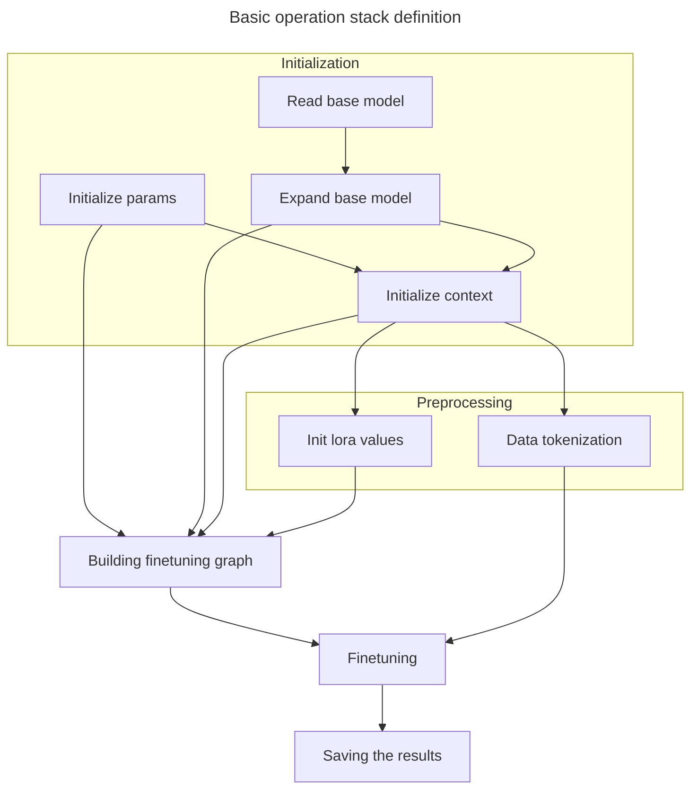

# llamacpp LORA 

## Lora implementation inside llama.cpp

source : https://github.com/xaedes/llama.cpp/tree/finetune-lora

```mermaid
---
title: Basic operation stack definition
---
graph TD
ip[Initialize params]
ictx[Initialize context]
rbm[Read base model]
tkn[Data tokenization]
mexp[Expand base model]
rlor[Init lora values]
bcomp[Building finetuning graph]
ftn[Finetuning]
svr[Saving the results]


subgraph Initialization
ip --> ictx
rbm --> mexp
mexp --> ictx
end

subgraph Preprocessing
ictx --> tkn
ictx --> rlor
end

ip --> bcomp
mexp --> bcomp
ictx --> bcomp
rlor --> bcomp

bcomp --> ftn
tkn --> ftn

ftn --> svr

```