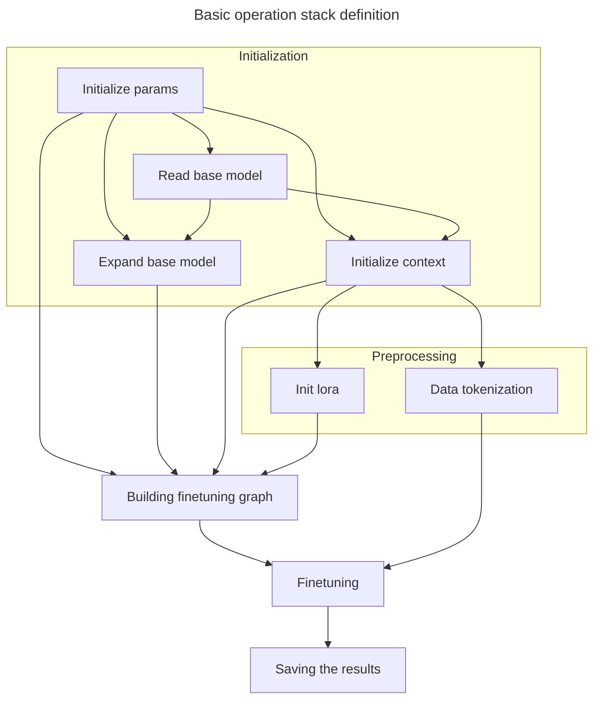

# llamacpp LORA 

## Lora implementation inside llama.cpp

source : https://github.com/xaedes/llama.cpp/tree/finetune-lora



## Breaking things up

### Parameters initialization
#### Lora parameters
Initializing parameters for lora training.

This set of parameters is specific for lora finetuning tasks
<details>
<summary>Parameters initialization code</summary>

```c++
static struct train_params get_default_train_params() {
    struct train_params params;
    params.common = get_default_train_params_common();
    params.fn_model_base     = "";
    params.fn_lora_out       = "ggml-lora-ITERATION-f32.gguf";

    params.only_write_lora = false;

    params.f_norm_rms_eps  = 1e-5f;
    params.rope_freq_base  = 10000.0f;
    params.rope_freq_scale = 1.0f;

    params.custom_f_norm_rms_eps  = false;
    params.custom_rope_freq_base  = false;
    params.custom_rope_freq_scale = false;

    params.lora_r      = 4; // lora rank
    params.lora_alpha  = 4; // scale of the lora impact
    params.custom_lora_alpha = false;

    // Specific params for lora ranks
    // Maintaining those ranks should benefit with performance/quality measures.
    // The higher the rank, the more accurate changes introduced by lora, but computation and storage  requirements wbt up as well.
    params.n_rank_attention_norm = 1;
    params.n_rank_wq             = 4;
    params.n_rank_wk             = 4;
    params.n_rank_wv             = 4;
    params.n_rank_wo             = 4;
    params.n_rank_ffn_norm       = 1;
    params.n_rank_w1             = 4;
    params.n_rank_w2             = 4;
    params.n_rank_w3             = 4;
    params.n_rank_tok_embeddings = 4;
    params.n_rank_norm           = 1;
    params.n_rank_output         = 4;

    params.custom_n_rank_attention_norm = false;
    params.custom_n_rank_wq             = false;
    params.custom_n_rank_wk             = false;
    params.custom_n_rank_wv             = false;
    params.custom_n_rank_wo             = false;
    params.custom_n_rank_ffn_norm       = false;
    params.custom_n_rank_w1             = false;
    params.custom_n_rank_w2             = false;
    params.custom_n_rank_w3             = false;
    params.custom_n_rank_tok_embeddings = false;
    params.custom_n_rank_norm           = false;
    params.custom_n_rank_output         = false;

    return params;
}
```

</details>

#### Default model paramaters
Initializing parameters for model processing.

<details>

Defining default parameters values.

This is a parameters for typical llama model.
```c++
struct llama_model_params llama_model_default_params() {
    struct llama_model_params result = {
        /*.n_gpu_layers                =*/ 0,
        /*.main_gpu                    =*/ 0,
        /*.tensor_split                =*/ nullptr,
        /*.progress_callback           =*/ nullptr,
        /*.progress_callback_user_data =*/ nullptr,
        /*.vocab_only                  =*/ false,
        /*.use_mmap                    =*/ true,
        /*.use_mlock                   =*/ false,
    };
#ifdef GGML_USE_METAL
    result.n_gpu_layers = 1;
#endif

    return result;
}
```

Actual parameters meanings
```c++
struct llama_model_params {
        int32_t n_gpu_layers; // number of layers to store in VRAM
        int32_t main_gpu;     // the GPU that is used for scratch and small tensors
        const float * tensor_split; // how to split layers across multiple GPUs (size: LLAMA_MAX_DEVICES)

        // called with a progress value between 0 and 1, pass NULL to disable
        llama_progress_callback progress_callback;
        // context pointer passed to the progress callback
        void * progress_callback_user_data;

        // Keep the booleans together to avoid misalignment during copy-by-value.
        bool vocab_only; // only load the vocabulary, no weights
        bool use_mmap;   // use mmap if possible
        bool use_mlock;  // force system to keep model in RAM
    };
```

</details>

### Reading base model

The idea is to read reference model, to make some modifications to it later. 

It's quite simple:

Reading model -> alternating model to introduce adapters -> finetuning -> profit
```cpp
struct llama_model * lmodel = llama_load_model_from_file(params.fn_model_base, llama_params);
```

### Expanding base model

This process performed in 2 steps:

1. Alternate base model of type `llama_model` -> `my_llama_model`. Not really sure why. The difference that I observe is eliminating bias in `my_llama_layer` which is replacement for base `llama_layer`.
2. Alternate `my_llama_model`, introducing lora values to each `my_llama_layer`.

#### Base model alternation

```c++
init_model(lmodel, &model, params.fn_model_base, params.common.n_ctx);
```

[Link to the method implementation](https://github.com/xaedes/llama.cpp/blob/546112944a0e025ec4a11d23dc57730041b8d273/examples/finetune/finetune.cpp#L278)

Nothing really special about this method. Just basic mapping and shapes assertion as far as I can see.

#### Introducing lora values
```c++
init_lora(&model, &lora);
```
[Link to the method implementation](https://github.com/xaedes/llama.cpp/blob/546112944a0e025ec4a11d23dc57730041b8d273/examples/finetune/finetune.cpp#L438)

Idea is to introduce additional values into the layer definition.

And then this weights will be used in computation graph such as:
```math
h = W_0x + \Delta Wx = W_0x + BAx
```
where:
- $B$, $A$ - low dimension matrices
- $W_0$ - original weights, frozen during finetuning


<details>
<summary>Adding new tensors to the layers</summary>

```c++
layer.attention_norm_a = ggml_new_tensor_2d(ctx, GGML_TYPE_F32, lparams.n_rank_attention_norm, n_embd);
layer.attention_norm_b = ggml_new_tensor_2d(ctx, GGML_TYPE_F32, lparams.n_rank_attention_norm, 1);

// Additional weights for attention module
layer.wq_a = ggml_new_tensor_2d(ctx, GGML_TYPE_F32, lparams.n_rank_wq, n_embd);
layer.wq_b = ggml_new_tensor_2d(ctx, GGML_TYPE_F32, lparams.n_rank_wq, n_embd);
layer.wk_a = ggml_new_tensor_2d(ctx, GGML_TYPE_F32, lparams.n_rank_wk, n_embd);
layer.wk_b = ggml_new_tensor_2d(ctx, GGML_TYPE_F32, lparams.n_rank_wk, n_embd_gqa);
layer.wv_a = ggml_new_tensor_2d(ctx, GGML_TYPE_F32, lparams.n_rank_wv, n_embd);
layer.wv_b = ggml_new_tensor_2d(ctx, GGML_TYPE_F32, lparams.n_rank_wv, n_embd_gqa);
layer.wo_a = ggml_new_tensor_2d(ctx, GGML_TYPE_F32, lparams.n_rank_wo, n_embd);
layer.wo_b = ggml_new_tensor_2d(ctx, GGML_TYPE_F32, lparams.n_rank_wo, n_embd);

// Additional weight to normalization module
layer.ffn_norm_a = ggml_new_tensor_2d(ctx, GGML_TYPE_F32, lparams.n_rank_ffn_norm, n_embd);
layer.ffn_norm_b = ggml_new_tensor_2d(ctx, GGML_TYPE_F32, lparams.n_rank_ffn_norm, 1);

// Additional weight to Feed-Forward module
layer.w1_a = ggml_new_tensor_2d(ctx, GGML_TYPE_F32, lparams.n_rank_w1, n_embd);
layer.w1_b = ggml_new_tensor_2d(ctx, GGML_TYPE_F32, lparams.n_rank_w1, n_ff);
layer.w2_a = ggml_new_tensor_2d(ctx, GGML_TYPE_F32, lparams.n_rank_w2, n_ff);
layer.w2_b = ggml_new_tensor_2d(ctx, GGML_TYPE_F32, lparams.n_rank_w2, n_embd);
layer.w3_a = ggml_new_tensor_2d(ctx, GGML_TYPE_F32, lparams.n_rank_w3, n_embd);
layer.w3_b = ggml_new_tensor_2d(ctx, GGML_TYPE_F32, lparams.n_rank_w3, n_ff);

```
</details>

Interesting thing though, that addition of values to FF and nomalization modules.
Because according to the original [paper](https://arxiv.org/abs/2106.09685), the authors highlight, that they **only adapting the attention weights**. Therefore other modules modification may lead to unexpected results and performance drop. 

*Though further investigation needed*